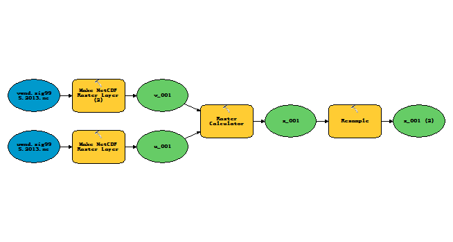
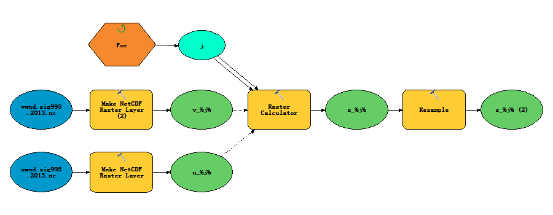
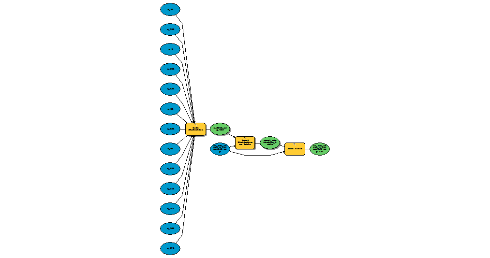
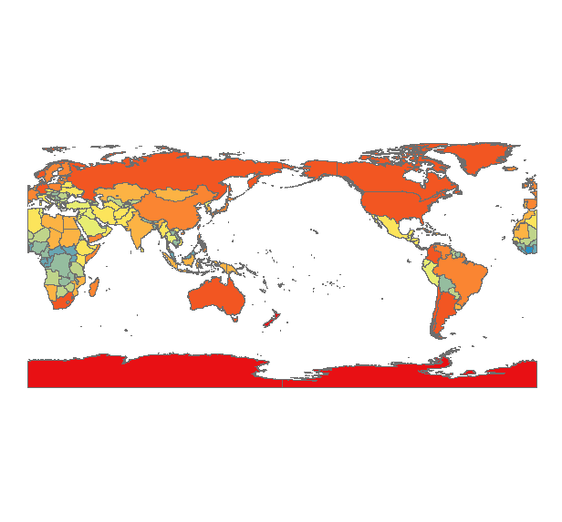

# Lab 1

## Basic Model

## Model with Iterator

## Summarizing Model

## Country Max Wind Production

## Summary of Top Countries

The top 3 countries by MAX wind speed were:

1. [Antarctica]
1. [France]
1. [Australia]

The top 3 countries by MEAN wind speed were:

1. [Australia]
1. [France]
1. [United Kingdom]
